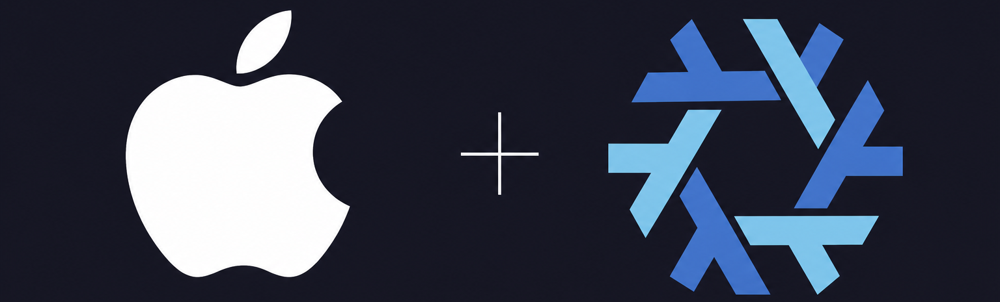

# nix-darwin-config

<p align="center">
  
</p>

<p align="center">
  
  
  
  
</p>

Declarative multi-host macOS setup (nix-darwin + home-manager + nix-homebrew +
sops-nix). Primary machine for this config is **`inferno`** (`ew`, Apple Silicon); add more
Macs under `hosts` in `flake.nix`.

One command applies everything on the current machine: edit this repo, then
`nixswitch`. A fresh Mac needs this clone, that host’s entry in `hosts`, and the
age private key from your password manager.

## Adapting for your machine

This flake is **multi-host**: every entry under `hosts` in `flake.nix` becomes a
`darwinConfigurations.<name>`.

| What                     | Where                                                                    |
| ------------------------ | ------------------------------------------------------------------------ |
| Host facts (per machine) | `flake.nix` → `hosts.<hostname>`                                         |
| Host-only overrides      | `hosts/<hostname>/default.nix`                                           |
| Shared modules           | `modules/darwin/`, `modules/home/` (all hosts import these)              |
| Clone path (optional)    | per-host `flakeDir` (default: `~/.config/nix-darwin-config`)             |
| Age recipient            | `.sops.yaml`: add that machine’s public key, then re-encrypt `secrets/` |
| Git identity             | `modules/home/tools/git.nix`                                             |

Example (keeping `inferno`, and add a second machine):

```nix
# flake.nix → outputs → let → hosts
hosts = {
  inferno = {
    system = "aarch64-darwin";
    username = "ew";
    timezone = "Asia/Calcutta";
    # Optional: override clone path used by nixswitch / nixup
    # (default: /Users/<username>/.config/nix-darwin-config).
    # flakeDir = "/Users/ew/.config/nix-darwin-config";
  };

  # New Mac. The attr key must match the hostname you switch with (#aurora)
  aurora = {
    system = "x86_64-darwin";       # Intel; use aarch64-darwin on Apple Silicon
    username = "ew";                # macOS username on that machine
    timezone = "America/New_York";  # IANA timezone
    # flakeDir = "/Users/ew/.config/nix-darwin-config";
  };
};
```

Then create `hosts/aurora/` (copy from `hosts/inferno/` and tweak if needed) and
on that machine run:

```bash
sudo nix run nix-darwin#darwin-rebuild -- switch --flake ~/.config/nix-darwin-config#aurora
```

(or `nixswitch` after the first switch, once aliases exist for that host).

## Bootstrap

Use this on **any** Mac this flake manages. Replace `<hostname>` with the
`hosts` attr key for that machine (e.g. `inferno`, `aurora`). Add the host in
[Adapting for your machine](#adapting-for-your-machine) before the first switch
if it is not already listed.

Order matters. The age private key must exist **before** the first switch, since
this flake sets `sops.age.generateKey = false`: a missing key fails instead of
minting a useless new one.

1. **Xcode Command Line Tools**

   ```bash
   xcode-select --install
   ```

2. **Install Nix** (flakes-capable)

   ```bash
   curl --proto '=https' --tlsv1.2 -sSf -L https://install.determinate.systems/nix | sh -s -- install
   ```

   Or use the [official installer](https://nixos.org/download.html). Open a new
   terminal afterward so `nix` is on `PATH`.

3. **Clone this repo** (default path; override with per-host `flakeDir` if needed)

   ```bash
   git clone https://github.com/KasimKaizer/nix-darwin-config.git ~/.config/nix-darwin-config
   cd ~/.config/nix-darwin-config
   ```

4. **Restore the age private key** from your password manager

   ```bash
   mkdir -p ~/.config/sops/age
   # paste the private key into ~/.config/sops/age/keys.txt
   chmod 600 ~/.config/sops/age/keys.txt
   ```

   That key’s public recipient must be listed in `.sops.yaml` for this machine.
   Never commit the private key.

5. **First activation** (`darwin-rebuild` is not on `PATH` yet)

   ```bash
   sudo nix run nix-darwin#darwin-rebuild -- switch --flake ~/.config/nix-darwin-config#<hostname>
   ```

   nix-homebrew installs and pins Homebrew + taps on this pass. Stay signed into
   the App Store so `masApps` can install.

6. **Once per machine after the first switch**

   ```bash
   exec zsh
   gh auth login
   ```

   - System Settings → Privacy & Accessibility → enable **skhd**
   - Configure **LuLu** in the app (rules stay outside nix)
   - Sign into iCloud / browsers / Bitwarden as needed
   - Install anything under [Outside nix](#outside-nix)

## Commands

After the first switch, these zsh aliases exist. Each machine gets aliases wired
to its own hostname from `flake.nix`:

| Alias | Action |
| --- | --- |
| `nixswitch` | apply the flake for the current machine (`…#<hostname>`) |
| `nixup` | `nix flake update` + switch + prune old system generations (keep 2) |
| `nix-rollback` | activate the previous system generation (undo a bad switch) |
| `nixgc` | collect system + user Nix store garbage |

Extra commands (not aliased):

```bash
cd ~/.config/nix-darwin-config
nix fmt                                            # format
nix flake check --no-build                         # evaluate without building
darwin-rebuild --list-generations                  # see all generations
sudo darwin-rebuild switch --switch-generation N   # jump to a specific one
```

**Warnings & gotchas:**

Don't `brew install` or `defaults write` anything you want to keep, because
`homebrew.onActivation.cleanup = "zap"` removes undeclared packages on switch.

`nixup` keeps only two system generations, so `nix-rollback` undoes just the
latest switch. For an older one, use `--list-generations` and
`--switch-generation N`.

Edit secrets with `sops secrets/secrets.yaml`, then `nixswitch` (command cheat
sheet is in the comments at the top of `.sops.yaml`).

Zed: `nixswitch` resets `~/.config/zed` to the repo baseline under
`modules/home/editors/zed/`. Keep permanent changes in the repo.

## Layout

```
.
├── flake.nix                      # inputs, host registry, darwinSystem, formatter
├── flake.lock
├── .sops.yaml                     # age recipients + creation rules
├── secrets/
│   └── secrets.yaml               # encrypted vault (safe to commit)
├── hosts/
│   └── inferno/
│       └── default.nix            # platform, hostname, timezone, primaryUser
└── modules/
    ├── darwin/                    # nix-darwin (system)
    │   ├── default.nix            # imports only
    │   ├── core.nix               # nix settings, GC/optimise, shells, PAM, firewall
    │   ├── defaults.nix           # system.defaults + login items
    │   ├── defaults/
    │   │   ├── dock-items.nix     # dock persistent-apps
    │   │   ├── itsycal.nix
    │   │   └── freedom.nix
    │   ├── fonts.nix
    │   ├── homebrew.nix           # casks / brews / masApps only
    │   ├── nix-homebrew.nix       # pin Homebrew + taps
    │   └── skhd.nix               # ⌘⌥ app-launch hotkeys
    └── home/                      # home-manager (user)
        ├── default.nix            # imports, packages, sessionVariables, xdg
        ├── shell/                 # zsh, starship
        ├── terminal/              # ghostty, zellij
        ├── editors/               # helix, vscode, zed (+ config baselines)
        └── tools/                 # git/gh/lazygit, ssh, cli, secrets, exercism
```

- System → `modules/darwin/`; user → `modules/home/`
- One module ≈ one concern; `default.nix` files are import lists
- CLI package → `modules/home/default.nix` (or the module that owns the tool)
- GUI / MAS app → `modules/darwin/homebrew.nix`
- macOS defaults → `modules/darwin/defaults.nix`

## Outside nix

**Manual installs:** CleanMyMac, PDF Expert, OnVUE, Rosalyn.

**State (not config):** `gh` auth (`~/.config/gh/hosts.yml`), browser / Bitwarden
profiles, Gemini / Copilot OAuth, App Store / iCloud, LuLu rules, JetBrains
Settings Sync, Chrome PWAs, `~/.claude` / `~/.ollama`. Age private key stays in
the password manager only.

## References

- [nix-darwin manual](https://nix-darwin.github.io/nix-darwin/manual/index.html)
- [home-manager options](https://nix-community.github.io/home-manager/options.html)
- [sops-nix](https://github.com/Mic92/sops-nix)
- [nix-homebrew](https://github.com/zhaofengli/nix-homebrew)
- [Nix package search](https://search.nixos.org/packages)
- [Homebrew formulae / casks](https://formulae.brew.sh/)
