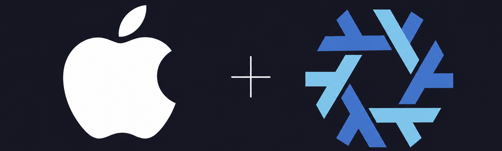

# nix-darwin-config

<p align="center">
  
</p>

<p align="center">
  
  
  
  
</p>

Declarative multi-host macOS setup (nix-darwin + home-manager + nix-homebrew +
sops-nix). Primary machine for this config is **`inferno`** (`ew`, Apple Silicon); add more
Macs under `hosts` in `flake.nix`.

One command applies everything on the current machine: edit this repo, then
`nixswitch`. A fresh Mac needs this clone, that host’s entry in `hosts`, and the
age private key from your password manager.

## Adapting for your machine

This flake is **multi-host**: every entry under `hosts` in `flake.nix` becomes a
`darwinConfigurations.<name>`.

| What                     | Where                                                                   |
| ------------------------ | ----------------------------------------------------------------------- |
| Host facts (per machine) | `flake.nix` → `hosts.<hostname>`                                        |
| Host-only overrides      | `hosts/<hostname>/default.nix`                                          |
| Shared modules           | `modules/darwin/`, `modules/home/` (all hosts import these)             |
| Clone path (optional)    | per-host `flakeDir` (default: `~/.config/nix-darwin-config`)            |
| Age recipient            | `.sops.yaml`: add that machine’s public key, then re-encrypt `secrets/` |
| Git identity             | `modules/home/tools/git.nix`                                            |

Example (keeping `inferno`, and adding a second machine):

```nix
# flake.nix → outputs → let → hosts
hosts = {
  inferno = {
    system = "aarch64-darwin";
    username = "ew";
    timezone = "Asia/Calcutta";
    # Optional: override clone path used by nixswitch / nixup
    # (default: /Users/<username>/.config/nix-darwin-config).
    # flakeDir = "/Users/ew/.config/nix-darwin-config";
  };

  # New Mac. The attr key must match the hostname you switch with (#aurora)
  aurora = {
    system = "x86_64-darwin";       # Intel; use aarch64-darwin on Apple Silicon
    username = "ew";                # macOS username on that machine
    timezone = "America/New_York";  # IANA timezone
    # flakeDir = "/Users/ew/.config/nix-darwin-config";
  };
};
```

Then create `hosts/aurora/` (copy from `hosts/inferno/` and tweak if needed). If
that machine uses a new age key, add its public key to `.sops.yaml` and run
`sops updatekeys secrets/secrets.yaml` first (skip if reusing the same key).

## Bootstrap

Use this on **any** Mac this flake manages. Replace `<hostname>` with the
`hosts` attr key for that machine (e.g. `inferno`, `aurora`). Add the host in
[Adapting for your machine](#adapting-for-your-machine) before the first switch
if it is not already listed.

Order matters. The age private key must exist **before** the first switch, since
this flake sets `sops.age.generateKey = false`: a missing key fails instead of
minting a useless new one.

1. **Xcode Command Line Tools**

   ```bash
   xcode-select --install
   ```

2. **Install Nix** (flakes-capable)

   ```bash
   curl --proto '=https' --tlsv1.2 -sSf -L https://install.determinate.systems/nix | sh -s -- install
   ```

   Or use the [official installer](https://nixos.org/download.html). Open a new
   terminal afterward so `nix` is on `PATH`.

3. **Clone this repo** (default path; override with per-host `flakeDir` if needed)

   ```bash
   git clone https://github.com/KasimKaizer/nix-darwin-config.git ~/.config/nix-darwin-config
   cd ~/.config/nix-darwin-config
   ```

4. **Restore the age private key** from your password manager

   ```bash
   mkdir -p ~/.config/sops/age
   # paste the private key into ~/.config/sops/age/keys.txt
   chmod 600 ~/.config/sops/age/keys.txt
   ```

   That key’s public recipient must be listed in `.sops.yaml` for this machine.

5. **First activation** (`darwin-rebuild` is not on `PATH` yet)

   ```bash
   sudo nix run nix-darwin#darwin-rebuild -- switch --flake ~/.config/nix-darwin-config#<hostname>
   ```

   nix-homebrew installs and pins Homebrew + taps on this pass. Stay signed into
   the App Store so `masApps` can install.

6. **Once per machine after the first switch**

   ```bash
   exec zsh
   gh auth login
   az login
   ```

   - System Settings → Privacy & Security → Accessibility → enable **skhd**
   - Configure **LuLu** in the app (rules stay outside nix)
   - Sign into iCloud / browsers / Bitwarden as needed
   - Install anything under [Outside nix](#outside-nix)

## Commands

After the first switch, these zsh aliases exist. Each machine gets aliases wired
to its own hostname from `flake.nix`:

| Alias          | Action                                                              |
| -------------- | ------------------------------------------------------------------- |
| `nixswitch`    | apply the flake for the current machine (`…#<hostname>`)            |
| `nixup`        | `nix flake update` + switch + prune old system generations (keep 2) |
| `nix-rollback` | activate the previous system generation (undo a bad switch)         |
| `nixgc`        | collect system + user Nix store garbage                             |

Extra commands (not aliased):

```bash
cd ~/.config/nix-darwin-config
nix fmt                                            # format
nix flake check --no-build                         # evaluate without building
darwin-rebuild --list-generations                  # see all generations
sudo darwin-rebuild switch --switch-generation N   # jump to a specific one
```

## Warnings & caveats

- **Homebrew is fully declarative.** `homebrew.onActivation.cleanup = "zap"` uninstalls anything not listed in `modules/darwin/homebrew.nix` on the next switch, and taps are pinned by the flake (`mutableTaps = false`), so `brew install` / `brew tap` by hand won't survive. Cask/formula versions only move via `nix flake update`.

- **`defaults write` doesn't stick.** Every key managed in `modules/darwin/defaults.nix` is reasserted on switch, reverting ad-hoc tweaks. Put the change in the repo instead.

- **inferno's right speaker is forced off.** This host's MacBook Air has a broken right speaker (buzzes/pops). `hosts/inferno/audio.nix` pans only that built-in device fully left; headphones and earbuds stay stereo. Do not copy this into a new host. The startup chime is also muted in NVRAM on inferno only (`system.startup.chime`).

- **The rollback window is short.** `nixup` prunes to the last two system generations and GC runs weekly (`--delete-older-than 7d`), so `nix-rollback` only undoes the latest switch and older generations disappear fast. For a still-existing older one: `darwin-rebuild --list-generations` + `--switch-generation N`.

- **Updates track unstable.** Inputs follow `nixpkgs-unstable` and home-manager `master`, so `nixup` can pull breaking changes. Check the result and `nix-rollback` if needed.

- **A missing age key fails the switch.** `sops.age.generateKey = false`, so `~/.config/sops/age/keys.txt` must be restored from the password manager before the first switch, and never committed. Edit the vault with `sops secrets/secrets.yaml`, then `nixswitch` (full command cheat sheet in the comments at the top of `.sops.yaml`). A new machine can't decrypt until its public key is added to `.sops.yaml` and the vault is re-encrypted (`sops updatekeys`).

- **rclone token refreshes are lost on switch.** `~/.config/rclone/rclone.conf` is materialized from the vault, so a token rclone rewrote locally is overwritten by the next switch. Copy it back with `sops set` (recipe in `.sops.yaml`).

- **Zed / VS Code configs are reset on switch.** Their config files are copied (not symlinked) into `~/.config/zed` and VS Code's User dir, overwriting local experiments. Keep permanent changes under `modules/home/editors/`. Zed's `settings.json` is rendered from sops templates, so never paste real API keys into the repo copy.

- **Editor extensions are only ever added.** VS Code IDs in `modules/home/editors/vscode/extensions.txt` are installed on switch, and Zed's `auto_install_extensions` installs on startup, but removing an entry from either list does not uninstall the extension; do that in the editor itself.

- **Agent skills are declarative.** Custom skills live in `skills/`; third-party skills are pinned and allowlisted in `modules/home/tools/skills.nix`. A switch deploys the same bundle to Zed (`~/.agents/skills`), Cursor, Codex, OpenCode, Antigravity, and Copilot. Do not use `npx skills` or edit those generated directories by hand.

- **A stale `.hm-bak` file blocks the switch.** When home-manager takes over an existing file it renames the original to `*.hm-bak`; if a later switch conflicts with that leftover backup, activation fails until you delete it.

- **Leave `stateVersion` alone.** `home.stateVersion` and `system.stateVersion` record when the config was created; don't bump them during updates.

- **Some things need one-time manual setup.** skhd needs Accessibility permission, `masApps` needs an App Store login, and LuLu rules live outside nix (see [Bootstrap](#bootstrap)).

## Layout

```
.
├── flake.nix                      # inputs, host registry, darwinSystem, formatter
├── flake.lock
├── .sops.yaml                     # age recipients + creation rules
├── secrets/
│   └── secrets.yaml               # encrypted vault
├── skills/                        # custom Agent Skills only (SKILL.md folders)
├── hosts/
│   └── inferno/
│       ├── default.nix            # platform, hostname, timezone, primaryUser
│       ├── audio.nix              # inferno-only: mute chime, pan right speaker off
│       └── mute-builtin-right-speaker.c
└── modules/
    ├── darwin/                    # nix-darwin (system)
    │   ├── default.nix            # imports only
    │   ├── core.nix               # nix settings, GC/optimise, shells, PAM, firewall
    │   ├── defaults.nix           # system.defaults + login items
    │   ├── defaults/
    │   │   ├── dock-items.nix     # dock persistent-apps
    │   │   └── itsycal.nix
    │   ├── fonts.nix
    │   ├── homebrew.nix           # casks / brews / masApps only
    │   ├── nix-homebrew.nix       # pin Homebrew + taps
    │   └── skhd.nix               # ⌘⌥ app-launch hotkeys
    └── home/                      # home-manager (user)
        ├── default.nix            # imports, packages, sessionVariables, xdg
        ├── shell/                 # zsh, starship
        ├── terminal/              # ghostty, zellij
        ├── editors/               # helix, vscode, zed (+ config baselines)
        └── tools/                 # azure, cli, git/gh/lazygit, ssh, secrets, exercism, skills
```

- System → `modules/darwin/`
- User → `modules/home/`
- One module ≈ one concern; `default.nix` files are import lists
- CLI package → `modules/home/default.nix` (or the module that owns the tool)
- GUI / MAS app → `modules/darwin/homebrew.nix`
- macOS defaults → `modules/darwin/defaults.nix`

## Outside nix

**Manual installs:** DoGitWork (via the App Store), OnVUE, Rosalyn.

**State (not config):** Azure CLI login/session data (`~/.azure`), `gh` auth
(`~/.config/gh/hosts.yml`), browser / Bitwarden profiles, Gemini / Copilot OAuth,
App Store / iCloud, LuLu rules, JetBrains Settings Sync, Chrome PWAs, and
`~/.ollama`.

## References

- [nix-darwin manual](https://nix-darwin.github.io/nix-darwin/manual/index.html)
- [home-manager options](https://nix-community.github.io/home-manager/options.html)
- [sops-nix](https://github.com/Mic92/sops-nix)
- [nix-homebrew](https://github.com/zhaofengli/nix-homebrew)
- [Nix package search](https://search.nixos.org/packages)
- [Homebrew formulae / casks](https://formulae.brew.sh/)
